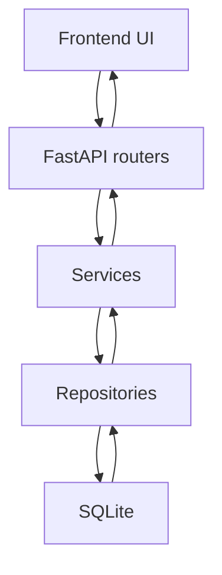

# Command Deck — Architecture (current)

This document describes the *implemented* v1 architecture as it exists in the repository.

Principles: local-first, explicit operations, minimal surface area, deterministic behaviour.

## 1) Backend architecture

### 1.1 Entry point

The FastAPI application is created in [`backend/app/main.py`](backend/app/main.py:1).

Key responsibilities:

- Create the app via an app factory (`create_app`).
- Use a lifespan handler (no deprecated startup hooks).
- Register routers for commands/outcomes/sessions/health.
- Serve the built frontend from `frontend/dist` when it exists (see §3).

### 1.2 Strict layering

Dependency direction:

```text
API → Services → Repositories → Database
```

Code locations:

- API routers (HTTP only): [`backend/app/api/`](backend/app/api/__init__.py:1)
- Services (business rules, validation): [`backend/app/services/`](backend/app/services/__init__.py:1)
- Repositories (SQL only): [`backend/app/repositories/`](backend/app/repositories/__init__.py:1)
- Domain (pure types/enums/schemas): [`backend/app/domain/`](backend/app/domain/__init__.py:1)
- Core wiring (config, DB connections, lifecycle): [`backend/app/core/`](backend/app/core/__init__.py:1)

### 1.3 HTTP API surface

Routers:

- Health: [`backend/app/api/health.py`](backend/app/api/health.py:1)
- Commands: [`backend/app/api/commands.py`](backend/app/api/commands.py:1)
- Outcomes: [`backend/app/api/outcomes.py`](backend/app/api/outcomes.py:1)
- Sessions: [`backend/app/api/sessions.py`](backend/app/api/sessions.py:1)

Error handling is intentionally simple and consistent (`{error: ...}`) and is centralized in the app factory.

### 1.4 Persistence (SQLite)

SQLite schema is created/ensured at runtime via [`init_db()`](backend/app/core/database.py:9).

Time handling:

- Stored in DB as UTC epoch seconds (integers).
- Rendered at the API boundary as ISO 8601 `Z` strings via helpers in [`backend/app/domain/models.py`](backend/app/domain/models.py:1).
- Session timestamps are the source of truth: each session stores `started_at` and `ended_at` (`ended_at` is null while active). Durations are always derived from these timestamps; any live timer in the UI is a presentation concern.

## 2) Frontend architecture

The v1 UI is a single-screen React app.

Entry:

- App root: [`frontend/src/App.tsx`](frontend/src/App.tsx:1)
- React bootstrap: [`frontend/src/main.tsx`](frontend/src/main.tsx:1)

API client:

- Fetch wrapper: [`frontend/src/api/http.ts`](frontend/src/api/http.ts:1)
- Commands client: [`frontend/src/api/commands.ts`](frontend/src/api/commands.ts:1)
- Outcomes client: [`frontend/src/api/outcomes.ts`](frontend/src/api/outcomes.ts:1)
- Sessions client: [`frontend/src/api/sessions.ts`](frontend/src/api/sessions.ts:1)

Primary UI feature:

- Board + session panel + timer: [`frontend/src/features/commands/Board.tsx`](frontend/src/features/commands/Board.tsx:1)
- Command detail drawer (edit + outcomes): [`frontend/src/features/commands/CommandDrawer.tsx`](frontend/src/features/commands/CommandDrawer.tsx:1)
- Create command modal: [`frontend/src/features/commands/CreateCommandModal.tsx`](frontend/src/features/commands/CreateCommandModal.tsx:1)

Frontend state model is intentionally small: fetch on load; refetch after mutations; derive the session timer client-side from the active session start time.

## 3) Single-address static serving

When a production build exists under `frontend/dist`, the backend serves it:

- `GET /` returns `index.html`
- `GET /assets/*` serves built assets when present
- `GET /{path:path}` returns `index.html` as an SPA fallback

Implementation:

- Dist directory resolution helper: [`frontend_dist_dir()`](backend/app/core/static_files.py:7)
- App wiring: [`create_app()`](backend/app/main.py:30)

## 4) Local runtime (tray)

The Windows-only tray runtime is implemented under [`backend/app/tray/`](backend/app/tray/__init__.py:1).

Entry point:

- Module runner: [`backend/app/tray/__main__.py`](backend/app/tray/__main__.py:1)

Runtime logic:

- Backend process launch + tray icon: [`backend/app/tray/runtime.py`](backend/app/tray/runtime.py:1)

## 5) Testing and quality gates

Backend tests are full-stack (API → service → repo → real SQLite) and run at 100% coverage.

- Test fixtures: [`backend/tests/conftest.py`](backend/tests/conftest.py:1)
- Coverage gate config: [`pyproject.toml`](pyproject.toml:1)

Mermaid overview:


