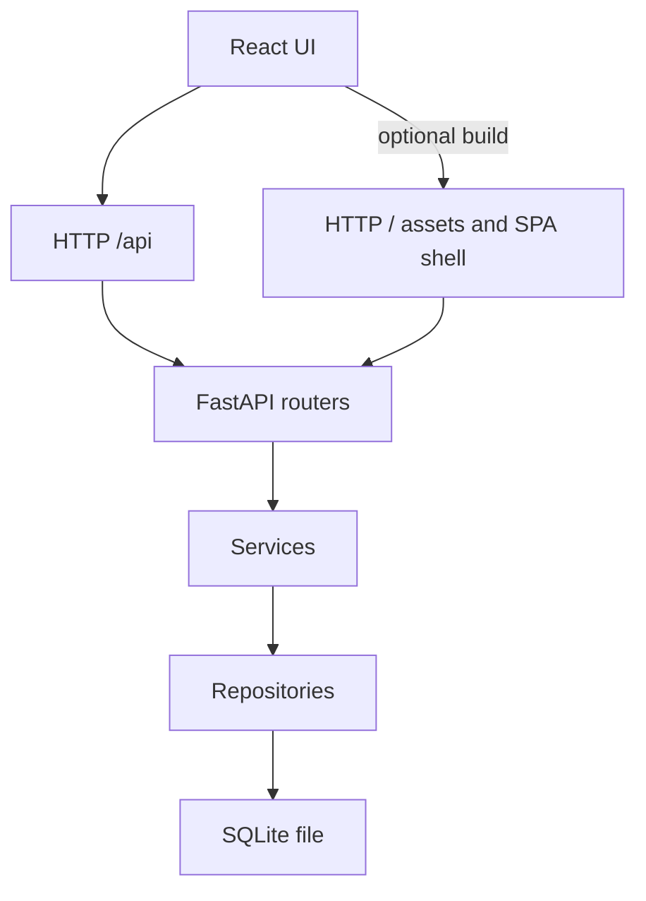

# Command Deck — Runtime Architecture (current)

This document describes the **implemented runtime architecture** as it exists in the repository.

Scope: FastAPI backend + React frontend + local tray launcher. Packaging/installer architecture is intentionally out of scope.

Principles: local-first, minimal surface area, deterministic behaviour, explicit operations.

## 1) Backend (FastAPI)

### 1.1 App creation + lifecycle

The FastAPI application is constructed via an app factory in [`backend/app/main.py`](backend/app/main.py:1).

Key runtime responsibilities in [`create_app()`](backend/app/main.py:30):

- Create the FastAPI app with title/version.
- Register routers for health/commands/outcomes/sessions.
- Centralize exception mapping to a small JSON error surface (`{error: ...}`) and stable status codes.
- Configure HTTP caching behaviour:
  - API responses (`/api/*`) are forced to no-store via middleware in [`_api_cache_control()`](backend/app/main.py:64).
  - Frontend HTML app shell is served with no-cache headers.
  - Hashed build assets are served with immutable caching (see §1.6).

Startup/shutdown uses the modern lifespan mechanism (no deprecated `on_event` hooks) via [`lifespan()`](backend/app/main.py:22), which ensures the database file/schema exist by calling [`init_database_file()`](backend/app/core/lifecycle.py:10).

### 1.2 Configuration (minimal)

Configuration is intentionally minimal and centralized in [`Settings`](backend/app/core/config.py:85) at [`backend/app/core/config.py`](backend/app/core/config.py:1).

- Default server bind is `127.0.0.1:8001` (see [`Settings.host`](backend/app/core/config.py:92) and [`Settings.port`](backend/app/core/config.py:93)).
- SQLite path is resolved by [`_default_sqlite_path()`](backend/app/core/config.py:44).
  - Override: `COMMANDDECK_SQLITE_PATH`.
  - Dev/source default: per-user app data (Windows: `LOCALAPPDATA`/`APPDATA`).
  - Runtime/installed default: next to the executable.

### 1.3 Layering and dependency direction

Dependency direction is one-way:

```text
API → Services → Repositories → SQLite
```

Code locations:

- API routers (HTTP only): [`backend/app/api/`](backend/app/api/__init__.py:1)
- Services (business rules, validation): [`backend/app/services/`](backend/app/services/__init__.py:1)
- Repositories (SQL only, transaction boundaries): [`backend/app/repositories/`](backend/app/repositories/__init__.py:1)
- Domain (pure enums/models/schemas/errors): [`backend/app/domain/`](backend/app/domain/__init__.py:1)
- Core wiring (settings, DB connection, lifecycle, static serving): [`backend/app/core/`](backend/app/core/__init__.py:1)

### 1.4 HTTP API surface

Routers:

- Health: [`backend/app/api/health.py`](backend/app/api/health.py:1)
- Commands: [`backend/app/api/commands.py`](backend/app/api/commands.py:1)
- Outcomes: [`backend/app/api/outcomes.py`](backend/app/api/outcomes.py:1)
- Sessions: [`backend/app/api/sessions.py`](backend/app/api/sessions.py:1)
- Board: [`backend/app/api/board.py`](backend/app/api/board.py:1)
- Snapshots: [`backend/app/api/snapshots.py`](backend/app/api/snapshots.py:1)

Notable endpoints (see router implementations for exact request/response schemas):

- Commands
  - List: [`list_commands()`](backend/app/api/commands.py:27) (`GET /api/commands`), optional `stage_id` + `status` filters.
  - Create: [`create_command()`](backend/app/api/commands.py:52) (`POST /api/commands`).
  - Update: [`update_command()`](backend/app/api/commands.py:89) (`PATCH /api/commands/{id}`).
  - Delete: [`delete_command()`](backend/app/api/commands.py:119) (`DELETE /api/commands/{id}`).
  - Reorder (persisted ordering): [`reorder_commands()`](backend/app/api/commands.py:131) (`POST /api/commands/reorder`).
- Outcomes
  - List for command: [`list_outcomes()`](backend/app/api/outcomes.py:28) (`GET /api/commands/{command_id}/outcomes`).
  - Create: [`create_outcome()`](backend/app/api/outcomes.py:41) (`POST /api/commands/{command_id}/outcomes`).
  - Delete: [`delete_outcome()`](backend/app/api/outcomes.py:52) (`DELETE /api/outcomes/{outcome_id}`).
- Sessions
  - List: [`list_sessions()`](backend/app/api/sessions.py:27) (`GET /api/sessions`), optional `stage_id` and `active`.
  - Active session: [`get_active_session()`](backend/app/api/sessions.py:43) (`GET /api/sessions/active`).
  - Latest session per stage: [`latest_by_stage_id()`](backend/app/api/sessions.py:54) (`GET /api/sessions/latest-by-stage-id`).
  - Start/stop: [`start_session()`](backend/app/api/sessions.py:72) and [`stop_session()`](backend/app/api/sessions.py:88).
    - Start requires selecting a task/command: request body is [`SessionStartRequest`](backend/app/domain/schemas.py:68) (`{command_id: int}`).

- Board
  - Get: [`get_board()`](backend/app/api/board.py:20) (`GET /api/board`).
  - Rename board: [`update_board()`](backend/app/api/board.py:32) (`PATCH /api/board`).
  - Update stage labels (renameable UI labels persisted per board): [`update_stage_labels()`](backend/app/api/board.py:47) (`PATCH /api/board/stage-labels`).

- Snapshots
  - List: [`list_snapshots()`](backend/app/api/snapshots.py:26) (`GET /api/snapshots`).
  - Save-now: [`save_snapshot()`](backend/app/api/snapshots.py:40) (`POST /api/snapshots`).
  - Load: [`load_snapshot()`](backend/app/api/snapshots.py:51) (`POST /api/snapshots/{snapshot_id}/load`).

### 1.5 Persistence (SQLite)

Connections are provided to request handlers via the FastAPI dependency [`get_db()`](backend/app/core/database.py:155).

Schema is created/ensured at runtime via [`init_db()`](backend/app/core/database.py:268). v1 intentionally does not use a migrations framework; instead it performs small, safe, idempotent upgrades.

Tables (see [`init_db()`](backend/app/core/database.py:268)):

- `commands`: task items with a persisted, per-stage ordering using `sort_index`.
  - Each command has a stable `stage_id` (one of `DESIGN/BUILD/REVIEW/COMPLETE`).
  - Ordering semantics live in [`CommandRepository.list()`](backend/app/repositories/command_repository.py:13) and are persisted via [`CommandRepository.reorder()`](backend/app/repositories/command_repository.py:136).
  - Startup upgrades:
    - Ensure/backfill `stage_id`: [`_ensure_commands_stage_id()`](backend/app/core/database.py:23)
    - Ensure/backfill `sort_index`: [`_ensure_commands_sort_index()`](backend/app/core/database.py:67)
- `outcomes`: immutable historical notes attached to commands (FK, cascade delete).
- `sessions`: **task-bound** time tracking; a row pins `command_id` + `stage_id` at start.
  - `ended_at` is `NULL` while active.
  - A startup upgrade preserves any legacy category-level sessions by renaming to `sessions_legacy*` and creates v2 sessions: [`_ensure_sessions_v2()`](backend/app/core/database.py:177)
- `board_state`: singleton board metadata.
  - Includes `stage_labels_json` (persisted stage label overrides): [`_ensure_board_state()`](backend/app/core/database.py:138)
- `snapshots`: named serialized board state with structural-hash dedupe: [`_ensure_snapshots()`](backend/app/core/database.py:241)

Time handling:

- Stored in SQLite as UTC epoch seconds (`INTEGER`).
- Rendered at the API boundary as ISO 8601 `Z` strings via [`epoch_seconds_to_iso8601_z()`](backend/app/domain/models.py:13) when constructing response schemas in [`backend/app/domain/schemas.py`](backend/app/domain/schemas.py:1).

Enums:

- Stages: [`StageId`](backend/app/domain/enums.py:6) (`DESIGN`, `BUILD`, `REVIEW`, `COMPLETE`).
- Status values: [`Status`](backend/app/domain/enums.py:42) (`Not Started`, `In Progress`, `Blocked`, `Complete`).

### 1.6 Single-address static serving (optional)

If a production build exists under `frontend/dist`, the backend serves it from the same address.

Implementation details:

- Dist directory resolution: [`frontend_dist_dir()`](backend/app/core/static_files.py:27).
  - Override: `COMMANDDECK_FRONTEND_DIST_DIR` (primarily for tests / non-standard deployments).
- Hashed build assets under `/assets/*` are mounted with long-lived immutable caching via [`AssetsStaticFiles`](backend/app/core/static_files.py:66).
- The HTML app shell (`/` and SPA fallback `/{path:path}`) is served with explicit no-cache headers in [`create_app()`](backend/app/main.py:30).

## 2) Frontend (Vite + React)

The v1 UI is a single-screen React application.

Entry points:

- App root: [`frontend/src/App.tsx`](frontend/src/App.tsx:1)
- React bootstrap: [`frontend/src/main.tsx`](frontend/src/main.tsx:1)

Dev-server integration:

- Vite proxies `/api/*` to the backend (default `http://127.0.0.1:8001`) in [`frontend/vite.config.ts`](frontend/vite.config.ts:1).

API client layer:

- Fetch wrapper + typed error handling: [`frontend/src/api/http.ts`](frontend/src/api/http.ts:1)
- Commands client: [`frontend/src/api/commands.ts`](frontend/src/api/commands.ts:1)
- Outcomes client: [`frontend/src/api/outcomes.ts`](frontend/src/api/outcomes.ts:1)
- Sessions client: [`frontend/src/api/sessions.ts`](frontend/src/api/sessions.ts:1)
- Board client: [`frontend/src/api/board.ts`](frontend/src/api/board.ts:1)
- Snapshots client: [`frontend/src/api/snapshots.ts`](frontend/src/api/snapshots.ts:1)

Primary UI feature:

- Board (columns by stage), drag-and-drop ordering, global Start/Add/Stop, session selection-mode + live timer: [`Board`](frontend/src/features/commands/Board.tsx:44)
- Command detail drawer (edit + outcomes): [`CommandDrawer`](frontend/src/features/commands/CommandDrawer.tsx:1)
- Create command modal: [`CreateCommandModal`](frontend/src/features/commands/CreateCommandModal.tsx:1)

Frontend state model (deliberately small):

- Load commands, board state, and session state on mount, then refetch after mutations (see [`refresh()`](frontend/src/features/commands/Board.tsx:118)).
- Session timer is derived client-side from the active session `started_at` timestamp and an interval tick (see [`nowMs`](frontend/src/features/commands/Board.tsx:58)).
- Reordering is persisted by sending full per-stage id lists to `POST /api/commands/reorder` (see [`commitReorder()`](frontend/src/features/commands/Board.tsx:112)).

Constants mirror backend enums:

- Stage/status lists used by the UI live in [`frontend/src/features/commands/constants.ts`](frontend/src/features/commands/constants.ts:1).

## 3) Local tray launcher (Windows-only)

The dev/source tray launcher lives under [`backend/app/tray/`](backend/app/tray/__init__.py:1).

- Entry point module: [`backend/app/tray/__main__.py`](backend/app/tray/__main__.py:1)
- Runtime logic (starts uvicorn as a background process and hosts a tray icon): [`run_tray()`](backend/app/tray/runtime.py:161)

## 4) Testing and quality gates

Backend tests are full-stack (API → service → repo → real SQLite) and enforce 100% coverage via [`pyproject.toml`](pyproject.toml:1).

- Test fixtures: [`backend/tests/conftest.py`](backend/tests/conftest.py:1)

Mermaid overview:


