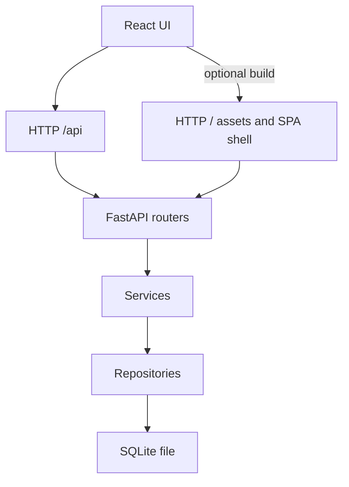

# Command Deck: Runtime Architecture

This document describes the **implemented runtime architecture** as it exists in the repository.

Scope: FastAPI backend + React frontend + tray launcher + packaged runtime behaviour.

Build instructions, packaging steps and developer workflows live in [`DEVELOPMENT.md`](DEVELOPMENT.md); the tests and quality gates in [`TESTING.md`](TESTING.md).

Principles: local-first, minimal surface area, deterministic behaviour, explicit operations.

## Invariants

Each holds in the code today and is enforced by the test named beside it.

- **One active session at a time.** Starting a session ends any session still running, in the same transaction. Enforced by `test_start_new_session_ends_previous` in [`test_sessions.py`](backend/tests/test_sessions.py).
- **A source run never writes its database into the repository.** Outside the packaged runtime the database lives under the per-user app data directory; the packaged runtime keeps it next to its EXE. Enforced by `test_default_sqlite_path_uses_localappdata_when_not_frozen` and `test_default_sqlite_path_uses_exe_dir_when_frozen` in [`test_runtime_paths.py`](backend/tests/test_runtime_paths.py).
- **Uninstall keeps the database unless asked otherwise.** The database and its WAL/SHM sidecars survive an uninstall by default. Enforced by `test_uninstall_preserves_db_by_default` and `test_uninstall_wipe_data_deletes_db_and_sidecars` in [`test_installer_uninstall_preserves_db.py`](backend/tests/test_installer_uninstall_preserves_db.py).
- **Reset clears operational state only.** Tasks, sessions and outcomes go; the board name, stage labels and snapshots stay. Enforced by `test_reset_board_clears_operational_state_and_preserves_metadata` in [`test_board_reset.py`](backend/tests/test_board_reset.py).
- **Caching never serves a stale UI or stale data.** API responses are `no-store`, the HTML app shell is no-cache and only hashed assets are cached as immutable. Enforced by `test_health_ok` in [`test_health.py`](backend/tests/test_health.py) and `test_static_serving_index_assets_and_spa_fallback` in [`test_static_serving.py`](backend/tests/test_static_serving.py).
- **The version has one home.** The repository-root `VERSION` file is read by the backend and the installer; neither carries its own copy. Enforced by [`test_version.py`](backend/tests/test_version.py).

## 1) Backend (FastAPI)

### 1.1 App creation + lifecycle

The FastAPI application is constructed via an app factory in [`backend/app/main.py`](backend/app/main.py:1).

Key runtime responsibilities in [`create_app()`](backend/app/main.py:32):

- Create the FastAPI app with its title and the version read from `VERSION` by [`backend/app/version.py`](backend/app/version.py:1).
- Register routers for health, board, commands, outcomes, sessions and snapshots.
- Centralize exception mapping to a small JSON error surface (`{error: ...}`) and stable status codes: request validation failures return 400 rather than FastAPI's default 422.
- Configure HTTP caching behaviour:
  - API responses (`/api/*`) are forced to no-store via middleware in [`_api_cache_control()`](backend/app/main.py:69).
  - Frontend HTML app shell is served with no-cache headers.
  - Hashed build assets are served with immutable caching (see §1.6).

Startup uses the lifespan mechanism (no deprecated `on_event` hooks) via [`lifespan()`](backend/app/main.py:25), which ensures the database file/schema exist by calling [`init_database_file()`](backend/app/core/lifecycle.py:10).

### 1.2 Configuration (minimal)

Configuration is intentionally minimal and centralized in [`Settings`](backend/app/core/config.py:86) at [`backend/app/core/config.py`](backend/app/core/config.py:1).

- Default server bind is `127.0.0.1:8001` (see [`Settings.host`](backend/app/core/config.py:92) and [`Settings.port`](backend/app/core/config.py:93)).
- SQLite path is resolved by [`_default_sqlite_path()`](backend/app/core/config.py:44).
  - Override: `COMMANDDECK_SQLITE_PATH`.
  - Dev/source default: per-user app data (Windows: `LOCALAPPDATA`/`APPDATA`).
  - Runtime/installed default: next to the executable.

### 1.3 Layering and dependency direction

Dependency direction is one-way:

```text
API → Services → Repositories → SQLite
```

Code locations:

- API routers (HTTP only): [`backend/app/api/`](backend/app/api/__init__.py:1)
- Services (business rules, validation): [`backend/app/services/`](backend/app/services/__init__.py:1)
- Repositories (SQL only, transaction boundaries): [`backend/app/repositories/`](backend/app/repositories/__init__.py:1)
- Domain (pure enums/models/schemas/errors): [`backend/app/domain/`](backend/app/domain/__init__.py:1)
- Core wiring (settings, DB connection, lifecycle, static serving): [`backend/app/core/`](backend/app/core/__init__.py:1)

### 1.4 HTTP API surface

Routers:

- Health: [`backend/app/api/health.py`](backend/app/api/health.py:1)
- Commands: [`backend/app/api/commands.py`](backend/app/api/commands.py:1)
- Outcomes: [`backend/app/api/outcomes.py`](backend/app/api/outcomes.py:1)
- Sessions: [`backend/app/api/sessions.py`](backend/app/api/sessions.py:1)
- Board: [`backend/app/api/board.py`](backend/app/api/board.py:1)
- Snapshots: [`backend/app/api/snapshots.py`](backend/app/api/snapshots.py:1)

Endpoints (see router implementations for exact request/response schemas):

- Health

  - [`health()`](backend/app/api/health.py:7) (`GET /api/health`).

- Commands

  - List: [`list_commands()`](backend/app/api/commands.py:27) (`GET /api/commands`), optional `stage_id` + `status` filters.
  - Create: [`create_command()`](backend/app/api/commands.py:52) (`POST /api/commands`).
  - Get one: [`get_command()`](backend/app/api/commands.py:77) (`GET /api/commands/{command_id}`).
  - Update: [`update_command()`](backend/app/api/commands.py:89) (`PATCH /api/commands/{command_id}`).
  - Delete: [`delete_command()`](backend/app/api/commands.py:119) (`DELETE /api/commands/{command_id}`).
  - Reorder (persisted ordering and stage moves): [`reorder_commands()`](backend/app/api/commands.py:131) (`POST /api/commands/reorder`).

- Outcomes

  - List for command: [`list_outcomes()`](backend/app/api/outcomes.py:35) (`GET /api/commands/{command_id}/outcomes`).
  - Create: [`create_outcome()`](backend/app/api/outcomes.py:48) (`POST /api/commands/{command_id}/outcomes`).
  - Latest per command, with counts: [`latest_outcomes()`](backend/app/api/outcomes.py:62) (`POST /api/outcomes/latest`, body `{command_ids: [...]}`).
  - All outcomes per command, newest first: [`outcomes_by_command()`](backend/app/api/outcomes.py:80) (`POST /api/outcomes/by-command`, body `{command_ids: [...]}`).
  - Delete: [`delete_outcome()`](backend/app/api/outcomes.py:97) (`DELETE /api/outcomes/{outcome_id}`).

- Sessions

  - List: [`list_sessions()`](backend/app/api/sessions.py:27) (`GET /api/sessions`), optional `stage_id` and `active`.
  - Active session: [`get_active_session()`](backend/app/api/sessions.py:44) (`GET /api/sessions/active`).
  - Latest session per stage: [`latest_by_stage_id()`](backend/app/api/sessions.py:55) (`GET /api/sessions/latest-by-stage-id`).
  - Start/stop: [`start_session()`](backend/app/api/sessions.py:73) (`POST /api/sessions/start`) and [`stop_session()`](backend/app/api/sessions.py:89) (`POST /api/sessions/stop`).
    - Start requires selecting a task/command: request body is [`SessionStartRequest`](backend/app/domain/schemas.py:91) (`{command_id: int}`).

- Board

  - Get: [`get_board()`](backend/app/api/board.py:25) (`GET /api/board`).
  - Rename board: [`update_board()`](backend/app/api/board.py:38) (`PATCH /api/board`).
  - Update stage labels (renameable UI labels persisted per board): [`update_stage_labels()`](backend/app/api/board.py:54) (`PATCH /api/board/stage-labels`).
  - Reset: [`reset_board()`](backend/app/api/board.py:78) (`POST /api/board/reset`).

- Snapshots

  - List: [`list_snapshots()`](backend/app/api/snapshots.py:34) (`GET /api/snapshots`).
  - Save now: [`save_snapshot()`](backend/app/api/snapshots.py:48) (`POST /api/snapshots`).
  - Load: [`load_snapshot()`](backend/app/api/snapshots.py:63) (`POST /api/snapshots/{snapshot_id}/load`).
  - Rename: [`rename_snapshot()`](backend/app/api/snapshots.py:73) (`PATCH /api/snapshots/{snapshot_id}`).
  - Delete: [`delete_snapshot()`](backend/app/api/snapshots.py:97) (`DELETE /api/snapshots/{snapshot_id}`).

### 1.5 Persistence (SQLite)

Connections are provided to request handlers via the FastAPI dependency [`get_db()`](backend/app/core/database.py:346).

Schema is created/ensured at runtime via [`init_db()`](backend/app/core/database.py:279). There is deliberately no migrations framework; instead it performs small, safe, idempotent upgrades.

Tables (see [`init_db()`](backend/app/core/database.py:279)):

- `commands`: task items with a persisted, per-stage ordering using `sort_index`.
  - Each command has a stable `stage_id` (one of `DESIGN/BUILD/REVIEW/COMPLETE`).
  - Ordering semantics live in [`CommandRepository.list()`](backend/app/repositories/command_repository.py:14) and are persisted via [`CommandRepository.reorder()`](backend/app/repositories/command_repository.py:163).
  - Startup upgrades:
    - Ensure/backfill `stage_id`: [`_ensure_commands_stage_id()`](backend/app/core/database.py:23)
    - Ensure/backfill `sort_index`: [`_ensure_commands_sort_index()`](backend/app/core/database.py:72)
- `outcomes`: immutable historical notes attached to commands (FK, cascade delete).
- `sessions`: **task-bound** time tracking; a row pins `command_id` + `stage_id` at start.
  - `ended_at` is `NULL` while active.
  - A startup upgrade preserves any legacy category-level sessions by renaming to `sessions_legacy*` and creates the task-bound table: [`_ensure_sessions_v2()`](backend/app/core/database.py:181)
- `board_state`: singleton board metadata.
  - Includes `stage_labels_json` (persisted stage label overrides): [`_ensure_board_state()`](backend/app/core/database.py:143)
- `snapshots`: named serialized board state with structural-hash dedupe: [`_ensure_snapshots()`](backend/app/core/database.py:252)

Time handling:

- Stored in SQLite as UTC epoch seconds (`INTEGER`).
- Rendered at the API boundary as ISO 8601 `Z` strings via [`epoch_seconds_to_iso8601_z()`](backend/app/domain/models.py:13) when constructing response schemas in [`backend/app/domain/schemas.py`](backend/app/domain/schemas.py:1).

Enums:

- Stages: [`StageId`](backend/app/domain/enums.py:6) (`DESIGN`, `BUILD`, `REVIEW`, `COMPLETE`).
- Status values: [`Status`](backend/app/domain/enums.py:42) (`Not Started`, `In Progress`, `Blocked`, `Complete`).

### 1.6 Single-address static serving (optional)

If a production build exists under `frontend/dist`, the backend serves it from the same address.

Implementation details:

- Dist directory resolution: [`frontend_dist_dir()`](backend/app/core/static_files.py:29).
  - Override: `COMMANDDECK_FRONTEND_DIST_DIR` (primarily for tests / non-standard deployments).
- Hashed build assets under `/assets/*` are mounted with long-lived immutable caching via [`AssetsStaticFiles`](backend/app/core/static_files.py:68).
- The HTML app shell (`/` and SPA fallback `/{path:path}`) is served with explicit no-cache headers in [`create_app()`](backend/app/main.py:32).

## 2) Frontend (Vite + React)

The UI is a single-screen React application.

Entry points:

- App root: [`frontend/src/App.tsx`](frontend/src/App.tsx:1)
- React bootstrap: [`frontend/src/main.tsx`](frontend/src/main.tsx:1)

Dev-server integration:

- Vite proxies `/api/*` to the backend (`http://127.0.0.1:8001`) in [`frontend/vite.config.ts`](frontend/vite.config.ts:1).

API client layer:

- Fetch wrapper + typed error handling: [`frontend/src/api/http.ts`](frontend/src/api/http.ts:1)
- Commands client: [`frontend/src/api/commands.ts`](frontend/src/api/commands.ts:1)
- Outcomes client: [`frontend/src/api/outcomes.ts`](frontend/src/api/outcomes.ts:1)
- Sessions client: [`frontend/src/api/sessions.ts`](frontend/src/api/sessions.ts:1)
- Board client: [`frontend/src/api/board.ts`](frontend/src/api/board.ts:1)
- Snapshots client: [`frontend/src/api/snapshots.ts`](frontend/src/api/snapshots.ts:1)

Primary UI feature:

- Board (columns by stage), drag-and-drop ordering and stage moves, global Start/Add/Stop, session selection-mode + live timer, the Snapshots menu and Reset board: [`Board`](frontend/src/features/commands/Board.tsx:60)
- Command detail drawer (edit + outcomes): [`CommandDrawer`](frontend/src/features/commands/CommandDrawer.tsx:32)
- Create command modal: [`CreateCommandModal`](frontend/src/features/commands/CreateCommandModal.tsx:18)

Frontend state model (deliberately small):

- Load commands, board state, session state and snapshots on mount, then refetch after mutations (see [`refresh()`](frontend/src/features/commands/Board.tsx:214)).
- Session timer is derived client-side from the active session `started_at` timestamp and a one-second interval tick (see [`nowMs`](frontend/src/features/commands/Board.tsx:82)).
- Reordering is persisted by sending full per-stage id lists to `POST /api/commands/reorder` (see [`commitReorder()`](frontend/src/features/commands/Board.tsx:208)).

Constants mirror backend enums:

- Stage/status lists used by the UI live in [`frontend/src/features/commands/constants.ts`](frontend/src/features/commands/constants.ts:1).

## 3) Local tray launcher (Windows-only)

The dev/source tray launcher lives under [`backend/app/tray/`](backend/app/tray/__init__.py:1).

- Entry point module: [`backend/app/tray/__main__.py`](backend/app/tray/__main__.py:1)
- Runtime logic (starts uvicorn as a background process with the repo venv's Python and hosts a tray icon): [`run_tray()`](backend/app/tray/runtime.py:161)

## 4) Packaged runtime entrypoint (Windows-only)

In addition to the dev/source tray launcher, the Windows release ships a packaged
runtime executable (`CommandDeck.exe`). Its entrypoint is
[`backend/runtime_entry.py`](backend/runtime_entry.py:1).

Key behaviours:

- **Single-instance guard**: uses a Windows file lock under LocalAppData to avoid
  multiple running instances. See [`_SingleInstanceLock.acquire()`](backend/runtime_entry.py:195).
- **Backend server in-process**: starts uvicorn via [`BackendServer.start()`](backend/runtime_entry.py:242)
  running the FastAPI app from [`app`](backend/app/main.py:129) on
  `http://127.0.0.1:8001/`.
- **Frontend static self-heal**: on first run, attempts to restore a missing
  `frontend/dist` directory from embedded resources. See
  [`_ensure_frontend_dist_present()`](backend/runtime_entry.py:94).
- **Runtime logging**: writes best-effort diagnostics next to the EXE at
  `CommandDeck-runtime.log`. See [`_runtime_log_path()`](backend/runtime_entry.py:52)
  and [`_debug_log()`](backend/runtime_entry.py:136).
- **Browser behaviour**: opens the UI URL on launch unless `--no-browser` (or
  `--background`) is provided. See [`main()`](backend/runtime_entry.py:353).
- **Version**: `VERSION` is bundled beside the compiled `app` package, where
  [`backend/app/version.py`](backend/app/version.py:1) reads it.

## 5) Testing and quality gates

Backend tests are full-stack (API → service → repo → real SQLite) and enforce 100% line and branch coverage via [`pyproject.toml`](pyproject.toml:1). The gates and the test layout are in [`TESTING.md`](TESTING.md).

- Test fixtures: [`backend/tests/conftest.py`](backend/tests/conftest.py:1)

Mermaid overview:


```mermaid
flowchart TD
  UI[React UI] --> HTTP[HTTP /api]
  HTTP --> API[FastAPI routers]
  API --> SVC[Services]
  SVC --> REPO[Repositories]
  REPO --> DB[SQLite file]
  UI -->|optional build| STATIC[HTTP / assets and SPA shell]
  STATIC --> API
```
